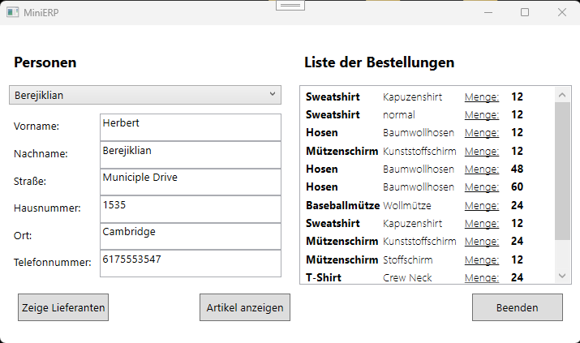
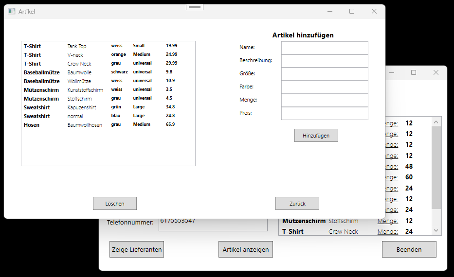
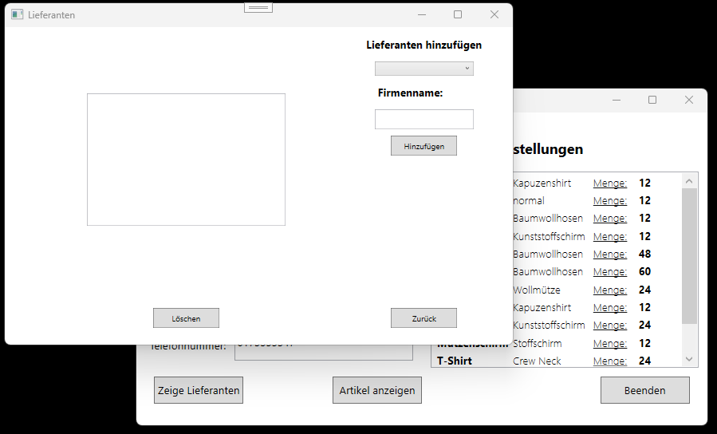

# MiniERP

MiniERP ist eine **einfache Desktop-Anwendung** in **C# WPF** zur Verwaltung von Personen, Bestellungen, Artikeln und Lieferanten.  
Die Anwendung nutzt eine **MySQL-Datenbank über ODBC** und ermöglicht grundlegende **CRUD-Funktionalitäten** (Create, Read, Update, Delete).

---

## Features

- **Personenverwaltung**
  - Auswahl von Kunden aus der Datenbank
  - Anzeige von Details (Vorname, Nachname, Adresse, Telefon)
  - Anzeige der Bestellungen der ausgewählten Person

- **Artikelverwaltung**
  - Anzeige aller Artikel
  - Hinzufügen neuer Artikel
  - Löschen von Artikeln

- **Lieferantenverwaltung**
  - Anzeige aller Lieferanten
  - Hinzufügen neuer Lieferanten
  - Löschen von Lieferanten

- **Navigation**
  - Wechsel zwischen Hauptfenster, Artikel- und Lieferantenfenster
  - Beenden der Anwendung

---

## Installation

- Im Projekt ist eine Datei [`database/miniERP.sql`](database/miniERP.sql) enthalten.
- Diese enthält die komplette Tabellenstruktur und einige Beispieldaten.

---

## ODBC-Treiber einrichten

- Installiere den **MySQL ODBC Connector**.
- Erstelle eine **DSN-Datenquelle** mit dem Namen `dbdemo2` (oder passe den ConnectionString im Code an).

---

## Abhängigkeiten

- .NET Framework 4.7.2 oder höher (WPF)  
- MySQL ODBC-Treiber installiert

---

## Screenshots

### Hauptfenster

### Artikelverwaltung

### Lieferantenverwaltung

---

## Code Struktur

- `MainWindow.xaml / MainWindow.xaml.cs`  
  - Hauptfenster mit Personen- und Bestellübersicht

- `Artikel.xaml / Artikel.xaml.cs`  
  - Verwaltung der Artikel: Anzeigen, Hinzufügen, Löschen

- `Lieferanten.xaml / Lieferanten.xaml.cs`  
  - Verwaltung der Lieferanten: Anzeigen, Hinzufügen, Löschen

- **Datenbankanbindung:** MySQL über ODBC (`OdbcConnection`, `OdbcCommand`, `OdbcDataAdapter`)

- **Datenbank-Datei:** [`database/miniERP.sql`](database/miniERP.sql) für Tabellenstruktur und Beispieldaten

---

## Nutzung

1. **Person auswählen** → Bestellungen anzeigen  
2. **Artikel anzeigen / hinzufügen / löschen**  
3. **Lieferanten anzeigen / hinzufügen / löschen**  
4. **Beenden** über Button oder Fenster schließen

